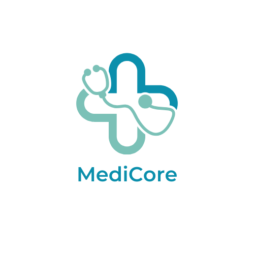

<!-- =========================
     MediCore HMS README
     ========================= -->

  

<h1 align="center">MediCore — Hospital Management System (HMS)</h1>

  A modular, full-stack healthcare operations platform designed to optimize clinical and administrative workflows with role-based experiences.

  
  
  
  

---

## 📌 Project Overview
**MediCore HMS** is a university group project engineered as a **feature-driven hospital operations suite**.  
The system digitizes end-to-end hospital processes including appointment scheduling, clinical record management, vaccination services, lab reporting with AI insights, healthcare packages, and patient utilities.  

Our delivery approach follows a **modular architecture**: each healthcare domain is implemented as a dedicated module, enabling clean scalability, parallel development, and straightforward maintainability.

---

## 🚀 Core Features
- **User / Customer Management**
  - Secure onboarding and authentication
  - Role-based access control (patient / doctor / admin)
  - Profile lifecycle and account management

- **Appointment Scheduling**
  - Patient appointment booking
  - Doctor availability and schedule visibility
  - Booking validation and coordination workflows

- **Medical Record Management**
  - Diagnosis cards, prescriptions, admission notes, allergies, history
  - Longitudinal record tracking for continuity of care

- **Vaccination Portal**
  - Doctor-side creation, updating, voiding, and validation of records
  - Patient vaccination history and timeline visibility
  - **PDF certificate generation + email dispatch**

- **Lab Report Management + AI Analysis**
  - Report upload, storage, retrieval, and review
  - AI-assisted extraction and decision support for indicators (e.g., cholesterol, diabetes)

- **Healthcare Packages & Utility Tools**
  - Package listing, CRUD, enrollment flows
  - BMI calculator and supportive patient utilities

---

## 🧩 High-Level Architecture
**Frontend (React)**  
Role-segmented UI delivered through dedicated domain pages. A shared API layer standardizes authorization headers, error handling, and client-side state transitions.

**Backend (Node.js / Express)**  
RESTful service layer with independent routers/controllers per module. Middleware enforces access boundaries and supports both JWT guards and lightweight header-based actor resolution for integration agility.

**Database (MongoDB / Mongoose)**  
Domain-specific schemas with timestamps, clinical status flags, void tracking, and certificate metadata for auditability.

> Architecture Diagram 
![System Architecture]

  

---

## 👥 Group Contributors (Equal Ownership)
This project was built as a collaborative university group solution. All team members contributed equally across planning, development, integration, testing, and final delivery.

### Contribution Breakdown

| Team Member | Ownership Areas |
|------------|------------------|
| **Sanjula Dilhara** | User Management, Healthcare Packages, Utility Tools |
| **Chenath Perera** | Lab Report Management, AI-based Report Analysis |
| **Rakindu Rajapaksha** | Vaccination Portal, BMI Calculator |
| **Thushan Shamendra** | Medical Record Management |
| **Dewduni Weerasundara** | Appointment Scheduling |

---

## 🙏 Acknowledgements
- **SLIIT Faculty of Computing** for academic guidance and supervision  
- Module lecturers and lab instructors for continuous support  
- Open-source libraries and community resources that accelerated development  
